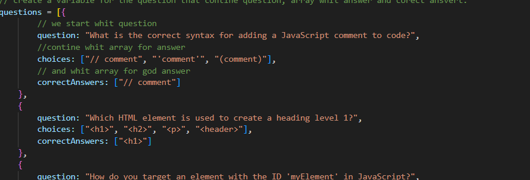
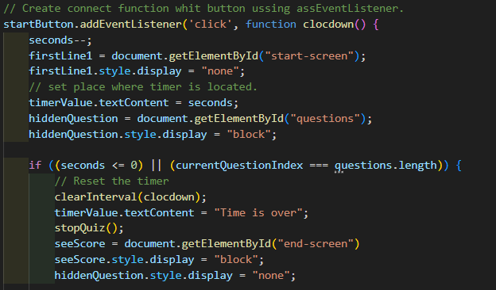

# Code-quiz-against-time
Create a quiz about coding whit timer.
## Description

- To learn more about API documentation.
- Sa a student I want to learn about programming and building small projects like that I acumlate more easily experience.
- I create a quiz about coding whit timer.
- More about API documentation and how to use it here.

## Installation

https://costinel22.github.io/Code-quiz-against-time/

## Usage
Questions block example, using sa ansverse array syntax and for good answers strings. 
 
 How to change screen to hide one to show another.
 

## Credits
https://www.freecodecamp.org/news/javascript-settimeout-js-timer-to-delay-n-seconds/
https://stackoverflow.com/questions/19384915/multiple-true-answers-in-javascript-array-prompt

## License

MIT License

## Tests

When press Start Quiz button it will appear in the screen question whit multiple answers.
After press on answer it will go at the next question.
At the end it willa appear in the screen a window that show the score and wil ask yow to add you initials.
And last screen it will tell you that you have x score.